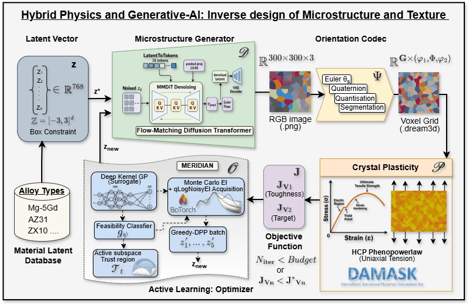
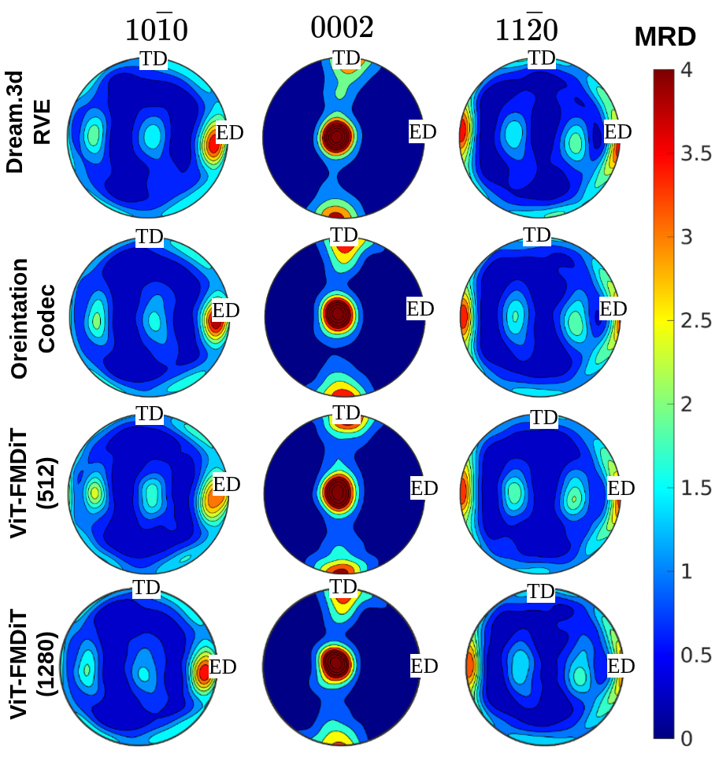

# orientation-codec

**An HCP-aware codec that turns crystallographic orientation fields into smooth RGB images, so standard image models (ViT, diffusion, flow matching) can learn and generate them. It then turns generated images back into DAMASK-ready DREAM.3D RVEs.**

This is the orientation codec **Ψ** of the physics-augmented generative inverse-design framework for extruded magnesium alloys. It is described in our Acta Materialia paper (Sec. 4) and in the Co-PiLOT NeurIPS 2026 paper (Sec. 3.2, App. C).

It is one of three companion repositories:

| Repository | Role in the pipeline |
|---|---|
| **orientation-codec** (this repo) | DREAM.3D orientation field ↔ RGB image, Ψ |
| [microstructure-encoder-decoder](https://github.com/mahishguru/microstructure-encoder-decoder) | ViT encoder + flow-matching / diffusion decoders that learn the microstructure latent space, D ([weights](https://huggingface.co/mahishguru/microstructure-encoder-decoder)) |
| [meridian](https://github.com/mahishguru/meridian) | MERIDIAN active-learning latent optimiser and the closed-loop inverse-design pipeline with the DAMASK oracle, O |

<p align="center"></p>
<p align="center"><em>The closed inverse-design loop. The orientation codec Ψ (this repository) turns the generator's RGB images into HCP orientation fields on a DREAM.3D voxel grid for the DAMASK crystal-plasticity oracle.</em></p>

---

## Why a dedicated codec

Mapping Euler angles straight onto RGB channels breaks neural networks in three ways:

1. **Periodicity.** 359° and 1° are almost the same orientation, but far apart numerically.
2. **The fundamental-zone trap.** If each grain is folded into the fundamental zone independently, two neighbouring grains only 2° apart can land at opposite edges of the zone. The resulting sharp colour edges get blurred by the network.
3. **Unstable quaternion reconstruction.** Rebuilding `q_w = sqrt(1 − |q_xyz|²)` returns NaN as soon as network noise pushes `|q_xyz| > 1`.

The codec avoids all three:

| Step | Encoding (DREAM.3D → RGB) |
|---|---|
| 1 | Bunge ZXZ Euler angles → unit quaternions |
| 2 | **Continuous unfolding.** A breadth-first search over the grain adjacency graph, starting from the largest grain, picks the one of the 12 HCP symmetry equivalents (and ± sign) of each grain that is closest to its already-assigned neighbour. Neighbouring grains therefore get similar colours. |
| 3 | **Class-level frame centring.** The mean quaternion of the alloy class (`class_means.json`) is rotated to the identity, keeping the projection away from `q_w = 0`. |
| 4 | **Stereographic projection.** `S = q_xyz / (1 + q_w)` lies in [−1, 1]³. |
| 5 | Quantise to an 8-bit PNG (the default, compatible with pretrained vision models) or a 16-bit TIFF. |

Decoding runs pixel by pixel: the rational inverse projection needs no square roots, then the class mean is restored and a vectorised fold into the HCP fundamental zone is applied. Grain labels come from the image itself (**self-segmentation** into connected components), so a *generated* image decodes with nothing but the class mean quaternion.

The full derivation and error analysis are in [docs/theory.md](docs/theory.md).

## Round-trip fidelity

Measured on 300 × 300 RVEs from three Mg-alloy classes (257–2,044 grains per sample), as reported in the papers:

| Format | Mean disorientation | Max disorientation | Boundary F1 | Grain-size Pearson r | Size |
|---|---|---|---|---|---|
| 16-bit TIFF | < 0.003° | < 0.006° | ≥ 0.9999 | ≥ 0.999 | ~527 KB |
| 8-bit PNG | 0.61–0.69° | 1.30–1.37° | ≥ 0.9999 | ≥ 0.999 | ~40 KB |

<table>
<tr>
<td align="center" width="62%"><br><em>Columns 1–2: original RVE and its codec round trip, which cannot be told apart. The remaining columns are FM-DiT reconstructions (see microstructure-encoder-decoder).</em></td>
<td align="center"><br><em>AZ31 pole figures. Row 2 (codec round trip) reproduces the DREAM.3D reference in row 1.</em></td>
</tr>
</table>

All errors are well below the 5° Read–Shockley low-angle boundary threshold, so any texture error seen downstream comes from the generative model, not from the representation. Self-segmentation of 8-bit images merges neighbours whose disorientation is below about 2–3°. Those are low-angle boundaries, physically the same grain; high-angle boundaries are always kept.

To reproduce these numbers on your own RVEs, see [Reproducing the paper numbers](#reproducing-the-paper-numbers).

---

## Installation

```bash
git clone https://github.com/mahishguru/orientation-codec.git
cd orientation-codec
pip install -e .            # or: pip install -e ".[dev]" to run the tests
```

Requires Python ≥ 3.9. Dependencies: `numpy`, `scipy`, `h5py`, `tifffile`, `Pillow`, `tqdm`. DAMASK is **not** required to use the codec; the `.dream3d` files it writes can be loaded by DAMASK directly.

Check the installation (no data needed):

```bash
pytest                                   # 12 tests on synthetic Voronoi RVEs, < 2 s
python examples/01_synthetic_roundtrip.py
```

## Quick start

### Decode a generated image into a DAMASK-ready RVE

```python
from orientation_codec import decode_image_pixelwise, load_class_means

means = load_class_means("data/class_means.json")
rve = decode_image_pixelwise(
    "data/examples/AZ31_extruded_orientation_1000.png",
    mean_q=means["AZ31_extruded"],
    output_path="AZ31_decoded.dream3d",
    spacing=(1.0, 1.0, 1.0),      # voxel size
    phase_name="Mg",              # written to CellEnsembleData/PhaseName
)

# import damask
# material = damask.ConfigMaterial.load_DREAM3D(rve, grain_data="Grain Data")
```

The output contains every group `damask.ConfigMaterial.load_DREAM3D` needs: `CellData` (`EulerAngles`, `FeatureIds`, `Phases`), `Grain Data` (`EulerAngles`, `Phases`, `Volumes`), `CellEnsembleData` (`CrystalStructures`, `NumFeatures`, `PhaseName`) and `_SIMPL_GEOMETRY`. It also writes an `.xdmf` companion file for ParaView.

### Encode a dataset for training (global-mean workflow)

```python
from orientation_codec import compute_class_means, batch_encode_global

# root/ has one sub-directory per alloy class, each containing .dream3d files
compute_class_means("root/", "root/class_means.json", samples_per_class=50, workers=8)
batch_encode_global("root/", "root/class_means.json", output_dir="encoded/", fmt="png", workers=8)
```

### Work with arrays

```python
import numpy as np
from orientation_codec import decode_pixelwise, segment_grains, load_png

img = load_png("generated.png")                         # (H, W, 3) uint8
euler = decode_pixelwise(img, means["Mg-5Gd_extruded"])  # (H, W, 3) Bunge ZXZ, radians
labels = segment_grains(img)                            # (H, W) int32 grain IDs
```

### Per-sample lossless workflow (archival)

This workflow writes `name.tiff`, `name_meta.json` and `name_labels.npy`, and decodes grain by grain with median pooling. The error is below 0.006°.

```python
from orientation_codec import encode_dream3d, decode_rgb_to_dream3d
tiff = encode_dream3d("sample.dream3d", output_dir="out/")
decode_rgb_to_dream3d(tiff)          # -> out/sample_decoded.dream3d
```

### Command line

```bash
# global-mean workflow
orientation-codec compute-means root/ -o root/class_means.json -s 50 -w 8
orientation-codec batch-global  root/ root/class_means.json -o encoded/ --fmt png -w 8
orientation-codec decode-pixelwise generated.png data/class_means.json --class-name AZ31_extruded -o rve.dream3d

# per-sample workflow
orientation-codec encode sample.dream3d -o out/
orientation-codec decode out/sample.tiff
orientation-codec batch  root/ -o out/ -w 8
orientation-codec verify sample.dream3d
```

### Loading encoded images in PyTorch

```python
import numpy as np, torch
from PIL import Image
x = np.asarray(Image.open("encoded.png"), dtype=np.float32) / 255.0 * 2 - 1   # [-1, 1]
x = torch.from_numpy(x).permute(2, 0, 1)                                          # (3, H, W)
```

---

## Bundled data

| File | Content |
|---|---|
| `data/class_means.json` | Class-level mean quaternions `[x, y, z, w]` for the 15 extruded-Mg alloy classes used to train the decoders in the papers. You need this file to decode images produced by the released encoder–decoder checkpoints. |
| `data/examples/*.png` | Two encoded 300 × 300 RVEs from the training set (AZ31, Mg-5Gd). |

If you train on your own classes, compute your own class means with `compute_class_means`. Decoding with a different class mean than was used for encoding rotates the whole texture.

## Reproducing the paper numbers

```bash
python scripts/verify_roundtrip.py path/to/*.dream3d \
    --class-means data/class_means.json --class-name AZ31_extruded --out roundtrip.json
```

For each RVE, the script reports the mean, median, max and 95th-percentile per-grain HCP disorientation, the boundary F1, and the grain-size Pearson r for both PNG and TIFF. The papers use `ME21_extruded`, `Mg-10Gd_extruded` and `AZ31_extruded_heattreated` RVEs from the augmented dataset.

## Package layout

```
orientation_codec/
├── symmetry.py     # 12 proper HCP rotations (622), fundamental-zone folding
├── quaternion.py   # stereographic projection and its inverse, quaternion averaging
├── unfolding.py    # grain adjacency graph, anchored continuous unfolding (BFS)
├── dataset.py      # global-mean workflow: class means, encode, pixel-wise decode, self-segmentation
├── encoder.py      # per-sample workflow: Dream3D -> 16-bit TIFF (+ meta, labels)
├── decoder.py      # per-sample workflow: TIFF -> Dream3D (grain-wise median pooling)
├── io_utils.py     # DREAM.3D HDF5 read/write (DAMASK-compatible), XDMF, PNG, TIFF
├── metrics.py      # HCP disorientation, per-grain disorientation, boundary F1
├── synthetic.py    # Voronoi RVE generator for tests and demos
├── batch.py        # recursive batch conversion (per-sample workflow)
├── verify.py       # quick per-sample round-trip check
└── cli.py          # `orientation-codec` command
```

## Conventions

- Orientations are **Bunge ZXZ Euler angles in radians**, active crystal → sample.
- Quaternions use the SciPy order **`[x, y, z, w]`**.
- Crystal symmetry is applied on the **right** (`g · s`). Applying it on the left would rotate the crystal in the sample frame and scramble the texture.
- Only single-phase **HCP** (point group 622, 12 proper rotations) is implemented. Other point groups need a new operator list in `symmetry.py`.
- The RVEs are 2D (Z = 1). The codec neither resamples nor pads images, so any resizing is up to the data loader.

## License

MIT, see [LICENSE](LICENSE).

## Acknowledgements

Developed at the Institute of Material and Process Design, Helmholtz-Zentrum Hereon, Geesthacht, Germany.
